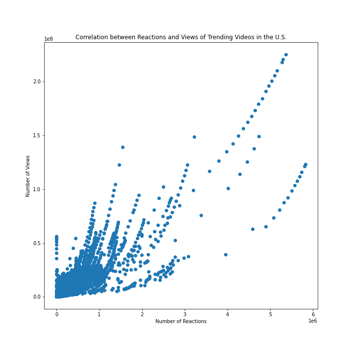
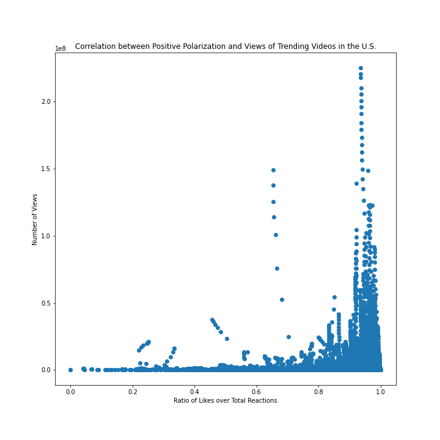
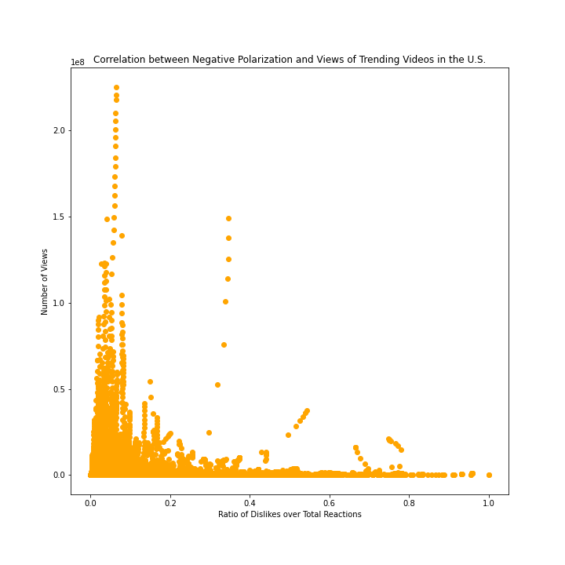
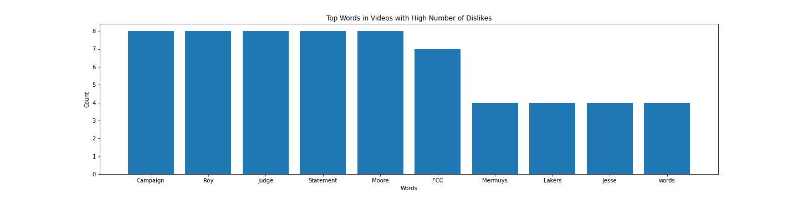
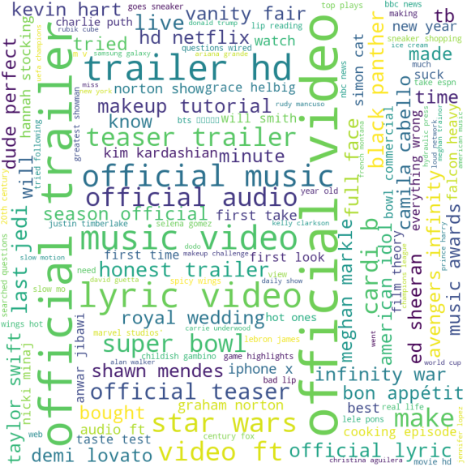

# data-512-final - What makes Youtube videos trend?
This repository contains all the files for a data exploration project on trending Youtube videos data. The data is analyzed for insights and assessment of social dynamics in the online video content domain. 
### Abstract
The purpose of this data analysis is to understand what makes Youtube videos trend. Is it the content, the uploader or is it a snowball effect of the popularity of the video itself? With online content gaining an increasing share of the human experience, I want to understand what makes content popular. Another rising career for people is being online influencers, many of whom are found on Youtube. What content empowers people to influence other people? Also I would like to understand if negative popularity is as good as positive popularity in the online content world where content is essentially free or paid for by human attention instead of money. I process, analyze, and visualize data of trending videos in the United States to assess these statements. The first part of the report analyzes videos reactions finding a high correlation between likes and views, while the second delves into video text finding common themes like entertaiment. Finally, I asses the relationship between videos and the channel to find that videos from popular channels are indeed promoted to trending lists over individual 'viral' videos. 
### Dataset
- The data is publicly available and can be found at [this link](https://www.kaggle.com/datasnaek/youtube-new)
- The data is licensed for CCO: Public Domain
- The data was scraped using the publicly avaiable Youtube API. Reproducibilty information on how the data was scraped and terms of use can be found in this [public repository](https://github.com/mitchelljy/Trending-YouTube-Scraper)
### Analysis and Results
1. Are number of likes or disikes correlated to number of views?

2. Do videos with high positive or negative polarization have higher number of views?

3. Does negativity gain more viewer traction than positivity? Hypothesis: Negative polarity videos have more views. 

4. Can videos with negative or inappropriate content trend? What makes negative videos trend? 

5. What themes of videos have the most viewership?

6. Is popularity attributed to specific videos or channels/uploaders?

